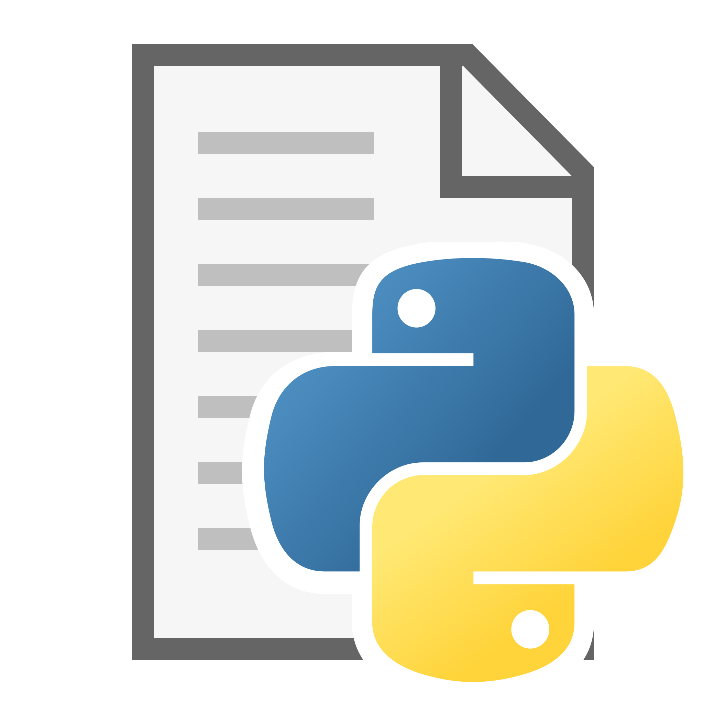

<a name="readme-top"></a>

<!-- PROJECT LOGO -->
<br />
<div align="center">
  <a href="logo.png">
    
  </a>

<h3 align="center">File Component</h3>

  <p align="center">
    Python component saves and restore objects from file
    <br />
  </p>
</div>


<!-- TABLE OF CONTENTS -->
<details>
  <summary>Table of Contents</summary>
  <ol>
    <li>
      <a href="#about-the-project">About The Project</a>
      <ul>
        <li><a href="#built-with">Built With</a></li>
      </ul>
    </li>
    <li>
      <a href="#getting-started">Getting Started</a>
      <ul>
        <li><a href="#prerequisites">Prerequisites</a></li>
        <li><a href="#installation">Installation</a></li>
      </ul>
    </li>
    <li><a href="#usage">Usage</a></li>
  </ol>
</details>


<!-- ABOUT THE PROJECT -->

## About The Component

This is a reusable component in Python that allows users to save and load Python objects
to and from a file. This component could be useful for applications that require persistent storage of data.

The component could be implemented as a Python class that provides methods for saving objects to a file and loading
objects from a file. It could use Python's built-in serialization module, such as "pickle", to convert objects
to a byte stream that can be written to a file.

To save objects to a file, the component takes the object to be saved as a parameter, along with the file path. It could
then convert the object to a byte stream using the serialization module, and write the byte stream
to the file. To load objects from a file, the component takes the file path as parameter, and
return the loaded object.
In the future, the component could also provide additional features, such as compression and encryption, to enhance data
security and reduce file size.

<p align="right">(<a href="#readme-top">back to top</a>)</p>

### Built With

In this project, the utilization of the pickle module signifies the ability to serialize and deserialize Python objects,
allowing efficient storage and retrieval of complex data structures. By employing Python and pickle, this project
benefits from Python's simplicity and flexibility while utilizing pickle's functionality for seamless object
serialization and deserialization.


<p align="right">(<a href="#readme-top">back to top</a>)</p>


<!-- GETTING STARTED -->

## Getting Started

This is an example of how you may give instructions on downloading the component.
To get a local copy up and running follow these simple example steps.

### Prerequisites

First of all, you have to had installed Python and

* Python 3
  ```sh
  sudo apt install python3
  python3 -v
  ```

### Installation

Next, I leave you the steps to follow to be able to use this component in your project.

1. Download this repo and put it in your project to be able to call it.
2. Once the repository is in the project folder you want to use, all you have to do is import it into the file you need.
   ```sh
   from component import *
   ```
3. This is how easy it is to install the component, now we are going to see how to use all its methods.

<p align="right">(<a href="#readme-top">back to top</a>)</p>


<!-- USAGE EXAMPLES -->

## Usage

### Save Object

To save the object use the method <b>saveObject</b>. You have to pass 2 arguments:
* object -> The object you want to save.
* filePath -> The path of the file you will save the object.

   ```sh
   component.saveObject(object, filePath)
   ```

### Restore Object

To restore the object use the method <b>restoreObject</b>. You have to pass 2 arguments:
* index > The index (id) of the object you want to restore.
* filePath -> The path of the file you will restore the object.

   ```sh
   component.restoreObject(index, filePath)
   ```

### Update Object

To update an object use the method <b>updateObject</b>. You have to pass 3 arguments:
* index -> The index (id) you want to update.
* newObject -> The new object you want to save.
* filePath -> The path of the file you will update the object.

   ```sh
   component.updateObject(index, newObject, filePath)
   ```

### Delete Object

To delete the object use the method <b>deleteObject</b>. You have to pass 2 arguments:
* index -> The index (id) you want to delete.
* filePath -> The path of the file you will delete an object.

   ```sh
   component.deleteObject(index, filePath)
   ```

### Delete Objects

To remove all the objects in a file use the method <b>deleteFileContent</b>. You have to pass an argument:
* filePath -> The path of the file you will remove all the objects.

   ```sh
   component.deleteFileContent(filePath)
   ```

### Get All Objects

To get all the objects in a file use the method <b>getAll</b>. You have to pass an argument:
* filePath -> The path of the file you will get all the objects.

   ```sh
   component.getAll(filePath)
   ```

<p align="right">(<a href="#readme-top">back to top</a>)</p>


## Contact

Ribadev - [GitHub](https://github.com/Riba00)

Project Link: [https://github.com/Riba00/RibaComponent](https://github.com/Riba00/RibaComponent)

<p align="right">(<a href="#readme-top">back to top</a>)</p>
